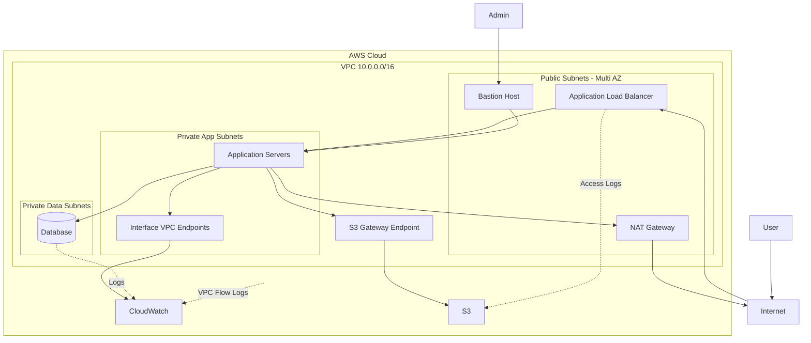
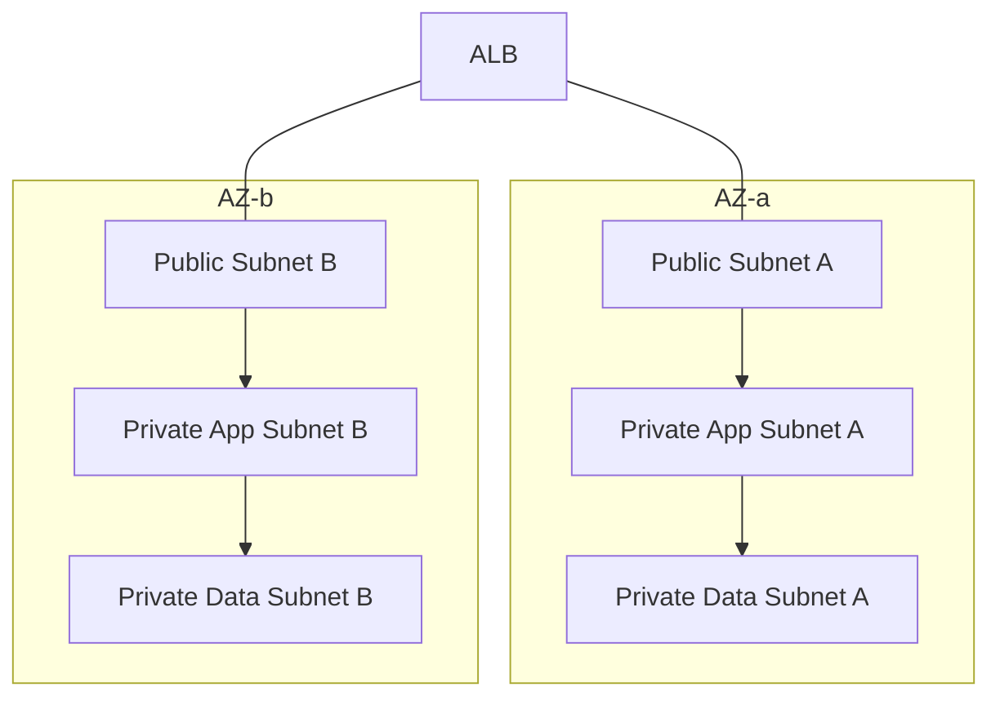
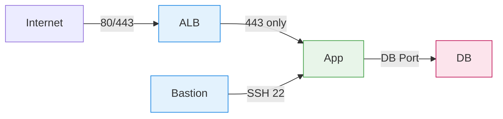

# Cloud Computing - Secure Multi-AZ AWS Architecture

## Overview

This assignment demonstrates a production-grade, highly available, and secure AWS network architecture designed to host a standard three-tier web application. The architecture is deployed inside a custom VPC with public, private application, and private data subnets across multiple Availability Zones (AZs).

## Architecture Overview

## Multi-AZ Subnet Design

## Network Traffic Flow

## Assumptions
- **Application type**: The system hosts a standard three-tier web application with a stateless application tier and a relational database for durable data storage (Public → App → Data).
- **Traffic profile**: The application supports hundreds of concurrent users under normal conditions, with traffic scaling to thousands of concurrent users during peak hours and dropping significantly during off-peak periods such as weekends.  
- **Disaster recovery**: The application is designed for high availability and resilience, targeting minimal downtime during infrastructure failures or disaster scenarios.
- **Data durability**: User data is persisted in a relational database with automated backups enabled to ensure durability and prevent data loss.
- **Operational constraints**: The client prefers managed AWS services to minimize operational overhead and ongoing maintenance effort.

## Trade-off
### Cost vs Performance
- If p95 latency is a hard SLO, prioritize performance with higher baseline capacity and pre-scaling, at the expense of higher cost.
- If p95 latency can degrade gracefully, favor cost efficiency through elastic scaling, accepting temporary latency increases during peak traffic.

### Cost vs Operability 
- Managed services cost more sometimes, but save people-time (patching, upgrades, on-call burden).
- More observability (logs, traces, metrics retention) improves MTTR but can become a major bill.

### Monolith vs Microservice
- Monolith + single DB is simpler and reliable early.
- Microservices/event-driven improves scaling boundaries but increases debugging, observability, and deployment complexity.

## Design Choices
I start with a cost-efficient Multi-AZ baseline that meets normal load. And I add performance components only where the bottleneck shows up. 

### Public
- ALB (HTTP→HTTPS redirect, TLS termination) across 3 AZs
- Bastion Host

### App (Private)
- ASG across 3 AZs
- Small min capacity, scale on CPU + request count (target tracking)
- Stateless app: sessions in JWT

### Data (Private)
- RDS Multi-AZ (cost-effective HA)
- Start with one writer, no replicas initially
- Enable automated backups + monitoring

### Networking
- NAT Gateway for outbound internet from private
- Keep NACLs simple guardrails, rely on SGs for least privilege.

## Future Improvements
### Reduce app latency cheaply
- Add CloudFront in front of ALB for caching static + dynamic content.
- Put static assets in S3 + CloudFront.

### Protect the DB
- Introduce ElastiCache (Redis) for hot reads and session caching.
- Add RDS read replicas if read-heavy

### Handle spikes without overprovisioning
- Decouple heavy or bursty tasks using SQS (e.g., email, image processing, analytics).

### Scale storage/IO limits
- Vertically scale the RDS instance class first; consider migrating to Aurora if I/O or scalability becomes a bottleneck.

### Improve Networking Latency and Security
- Use VPC endpoints to reduce NAT latency and data transfer cost.
- Replace SSH access with AWS Systems Manager (SSM) to eliminate the need for a bastion host.

## Work in Detail

### 0. High Availability and Scalability
- Multi-AZ deployment across all tiers to eliminate single points of failure.
- Stateless application design behind an Application Load Balancer (ALB).

### 1. Reusability
- Infrastructure modularized by responsibility (network, security, compute, load balancer, database).
- Environment-specific configuration separated from reusable modules (dev / staging / prod).

### 2. Observability
- Centralized logging using Amazon CloudWatch Logs with enforced retention policies.
- VPC Flow Logs enabled to provide network-level visibility and aid in debugging traffic issues.

### 3. Security
- Least-privilege IAM roles and policies applied to EC2, RDS, and supporting services.
- Strict tier-to-tier traffic control enforced using Security Groups and Network ACLs.
- Private subnets for application and database tiers with no direct internet exposure.

## Security Configuration

### 1. Network Isolation

- The architecture is deployed inside a dedicated **VPC (10.0.0.0/16)**.
- Subnets are separated by function and trust level:
  - **Public Subnets**: Load balancer, bastion host, NAT gateway
  - **Private App Subnets**: Application servers
  - **Private Data Subnets**: Database
- Private subnets **do not allow direct internet access**, reducing the attack surface.

### 2. Security Groups (Stateful Access Control)

Security groups enforce **least-privilege communication between tiers**:

| Component            | Allowed Inbound Traffic | Source              |
|----------------------|-------------------------|---------------------|
| Load Balancer        | HTTP / HTTPS            | Internet            |
| Application Servers  | HTTPS                   | Load Balancer       |
| Database             | Database Port           | Application Servers |
| Bastion Host         | SSH                     | Admin IP only       |

Key principles:
- No direct internet access to application or database layers
- Tier-to-tier access only on required ports
- Security groups reference trusted sources only

---

### 3. Network ACLs (Stateless Protection)

- Network ACLs provide an additional layer of defense at the subnet level.
- Only explicitly allowed traffic is permitted; all other traffic is denied.

---

### 4. Bastion Host Access

- Administrative access to private instances is only possible through the bastion host. 
- SSH access is restricted to approved administrator IP addresses. (Currently open to all for demo)
- Application servers do not accept direct SSH connections from the internet.

---

### 5. Outbound Internet Access via NAT Gateway

- Private subnets require outbound access for updates and external services.
- A NAT Gateway enables outbound internet connectivity without exposing private resources.
- Inbound connections from the internet remain blocked.

