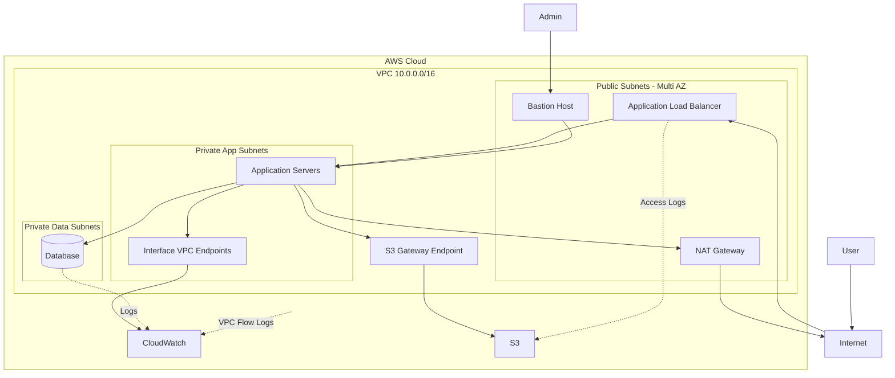
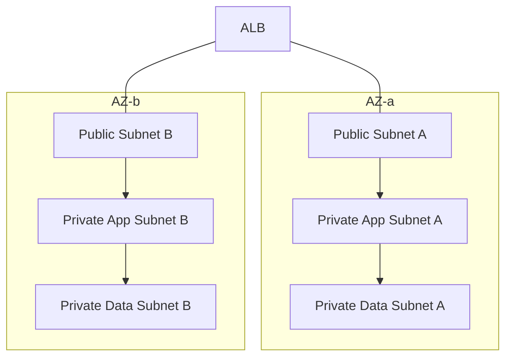
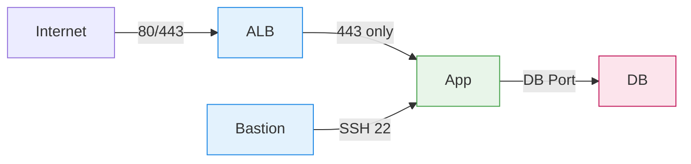

# Cloud Computing - Secure Multi-AZ AWS Architecture

## Overview

This assignment demonstrates a production-grade, highly available, and secure AWS network architecture designed to host a standard three-tier web application. The architecture is deployed inside a custom VPC with public, private application, and private data subnets across multiple Availability Zones (AZs).

## Architecture Overview

## Multi-AZ Subnet Design

## Network Traffic Flow

## Design Consideration

### 0. High Availability and Scalability
- Multi-AZ deployment across all tiers to eliminate single points of failure.
- [TBU] Horizontal scaling using Auto Scaling Groups (ASG) for the application tier.
- Stateless application design behind an Application Load Balancer (ALB).
- Managed database subnet group spanning multiple AZs to support high availability.

### 1. Reusability
- Infrastructure modularized by responsibility (network, security, compute, load balancer, database).
- Environment-specific configuration separated from reusable modules (dev / staging / prod).
- Explicit module inputs and outputs to avoid hidden coupling and enable safe refactoring.

### 2. Observability
- Centralized logging using Amazon CloudWatch Logs with enforced retention policies.
- VPC Flow Logs enabled to provide network-level visibility and aid in debugging traffic issues.
- CloudWatch metrics for ALB, EC2, NAT Gateway, and RDS to detect failures proactively.
- Infrastructure-level observability managed as code using Terraform.

### 3. Security
- Least-privilege IAM roles and policies applied to EC2, RDS, and supporting services.
- Strict tier-to-tier traffic control enforced using Security Groups and Network ACLs.
- Private subnets for application and database tiers with no direct internet exposure.
- [TBU] Secure administrative access using managed access patterns (SSM or tightly controlled key pairs).
- Encryption in transit via HTTPS/TLS and managed certificates using ACM.

### 4. Tradeoff Between Cost and Performance
- VPC endpoints (Gateway and Interface) used to enable private access to AWS services and reduce NAT Gateway costs.
- NAT Gateway scoped to only subnets that require outbound internet access.
- Log retention and monitoring tuned to balance operational visibility and cost.
- [TBU] Right-sized instance selection with auto scaling to avoid over-provisioning while maintaining performance.

## Security Configuration

### 1. Network Isolation

- The architecture is deployed inside a dedicated **VPC (10.0.0.0/16)**.
- Subnets are separated by function and trust level:
  - **Public Subnets**: Load balancer, bastion host, NAT gateway
  - **Private App Subnets**: Application servers
  - **Private Data Subnets**: Database
- Private subnets **do not allow direct internet access**, reducing the attack surface.

### 2. Security Groups (Stateful Access Control)

Security groups enforce **least-privilege communication between tiers**:

| Component            | Allowed Inbound Traffic | Source              |
|----------------------|-------------------------|---------------------|
| Load Balancer        | HTTP / HTTPS            | Internet            |
| Application Servers  | HTTPS                   | Load Balancer       |
| Database             | Database Port           | Application Servers |
| Bastion Host         | SSH                     | Admin IP only       |

Key principles:
- No direct internet access to application or database layers
- Tier-to-tier access only on required ports
- Security groups reference trusted sources only

---

### 3. Network ACLs (Stateless Protection)

- Network ACLs provide an additional layer of defense at the subnet level.
- Only explicitly allowed traffic is permitted; all other traffic is denied.

---

### 4. Bastion Host Access

- Administrative access to private instances is only possible through the **bastion host**. 
- SSH access is restricted to approved administrator IP addresses. (Currently open to all for demo)
- Application servers do not accept direct SSH connections from the internet.

---

### 5. Outbound Internet Access via NAT Gateway

- Private subnets require outbound access for updates and external services.
- A **NAT Gateway** enables outbound internet connectivity without exposing private resources.
- Inbound connections from the internet remain blocked.

